中嶋謙互 (なかじま けんご, NAKAJIMA Kengo) work history
====

Twitter <a href="http://twitter.com/ringo">@ringo</a>  
github <a href="https://github.com/kengonakajima">https://github.com/kengonakajima</a> 
Facebook <a href="http://www.facebook.com/kengo.nakajima">kengonakajima timeline</a> 
Blog <a href="https://github.com/kengonakajima/blog">github.com/kengonakajima/blog </a> 

凡例
====
 - [役] 役職
 - [筆] 執筆
 - [談] インタビュー、パネルディスカッション、シンポジウム、講演など
 - [P] プログラミング/ソフトウェア実装
 - [GD] ゲームデザイン
 - [他] その他

History
====

 1. [P] [MMO] 1996 LIFESTORM (Javaアプレット版) 日本システムサプライ

 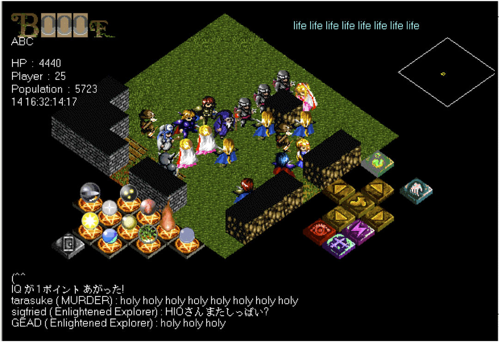
 

 1. [P] [MO+MMO] 1997 Lifestorm (Windows版) 日本システムサプライ

 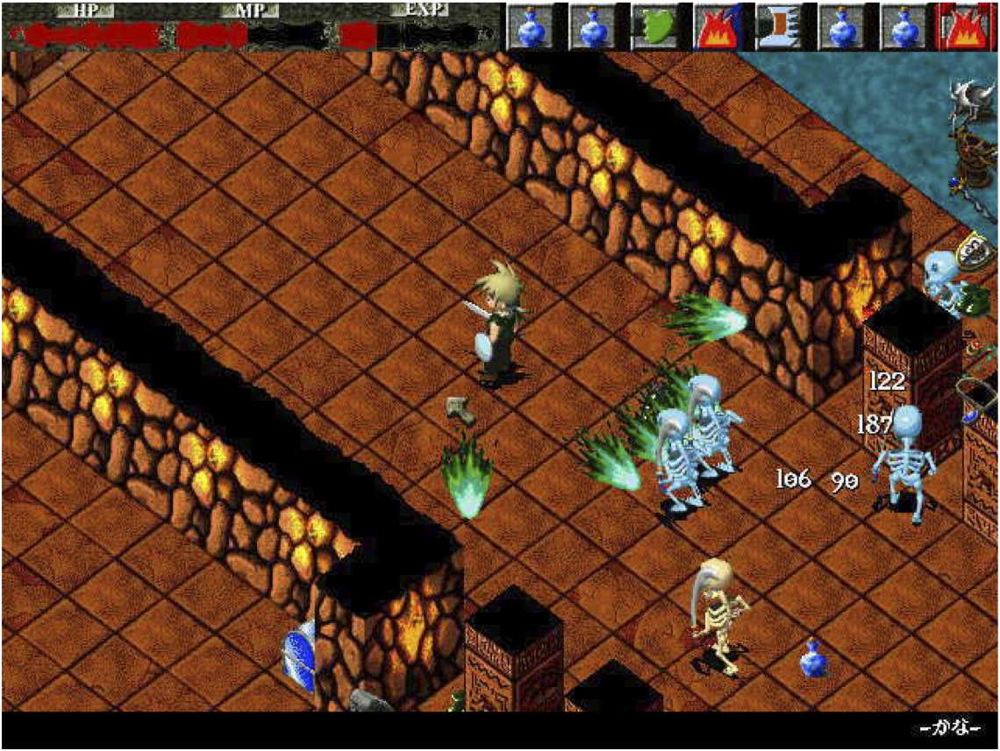

 1. [筆] 1997/04 Javaゲームプログラミング(softbank books)

 http://www.amazon.co.jp/dp/4797302291

 

 1. [P] [MMO] 1998 Lifestorm2 (Windows)

 

 1. [役] 2000/05 コミュニティーエンジン株式会社  代表取締役

 1. [P] 2001/02 socketラッパーライブラリ “VCE” コミュニティーエンジン

 http://classic-web.archive.org/web/20010202020600/http://www.vce-lab.net/

 

 1. [P] 2002/02 MMOG用ミドルウェア “mm-suite” コミュニティーエンジン

 http://classic-web.archive.org/web/20020401223926/http://www.vce-lab.net/

 1. [筆] 2002 Linuxマガジン「インサイド・オンラインゲーム」

 http://www.amazon.co.jp/Linux-magazine-the-DVD-Complete/dp/4756147100

 1. [P] [MMO] 2004/07

 http://replay.web.archive.org/20040805002540/http://gumonji.net/

 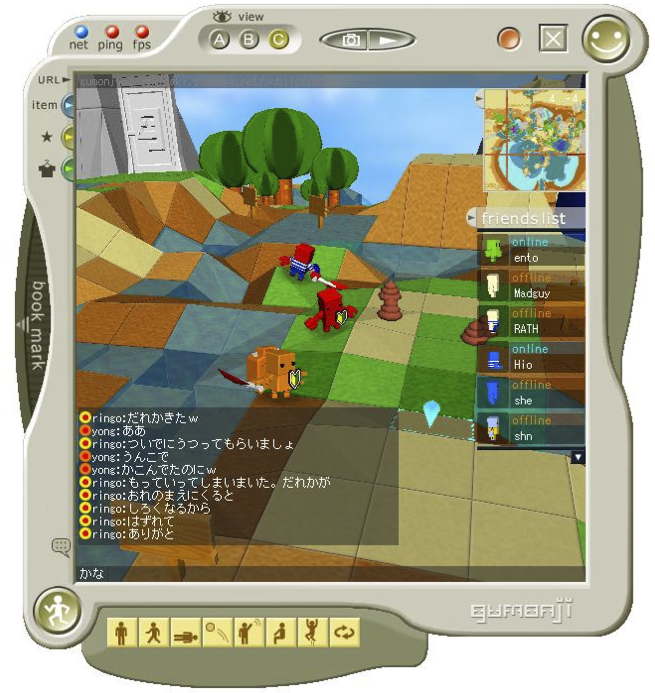
 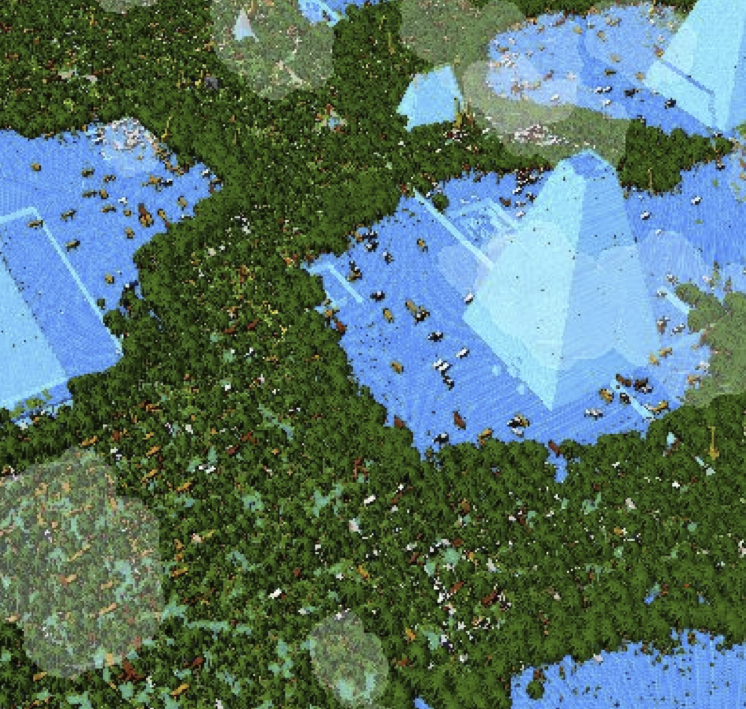

 1. [P] [Web] 2005/09 XM支援ツールGalapagos(IPA未踏ソフトウェア創造事業・スーパークリエイタ)

 http://www.ipa.go.jp/jinzai/esp/2005mito1/mdata/3-4.html

 1. [談] 2005/09 CEDEC ワールドシンセサイザー構想

 http://game.watch.impress.co.jp/docs/20050830/cedec1.htm

 1. [筆] 2006/06 情報処理 47(6), 641-646, 2006-06-15

 [50年後の情報科学技術をめざして(未来創像賞受賞)](http://ci.nii.ac.jp/naid/110004749770)

 1. [筆] 2007/07 ワールドワイド・マインド  (科学未来館サイト)

 http://www.miraikan.jst.go.jp/sp/deep_science/special/rebazaar/2007/07/post_2.html

 1. [談] 2009/09 CEDEC2009 MMOG開発の実際 (headlock/cave)

 http://cedec.cesa.or.jp/2009/ssn_archive/pdf/sep1st/NW46.pdf

 1. [談] 2009/12 Internet Watchインタビュー 

 http://internet.watch.impress.co.jp/docs/column/president/20091221_336426.html

 1. [P] [MMO] 2010/05 geotrion サーバ

 http://game.watch.impress.co.jp/docs/news/20100524_369209.html

 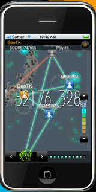

 1. [役] 2011/02 CEDEC2011 プログラムワーキンググループ オンライン担当

 http://cedec.cesa.or.jp/2011/board/index.html

 1. [筆][P] 2011/03 オンラインゲームを支える技術 (技術評論社, CEDEC2011著述賞)

 http://gihyo.jp/book/2011/978-4-7741-4580-8

 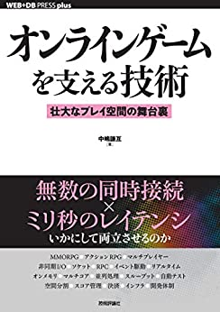

 1. [P][MMO] 2011/09/10 2032 Diver City (ゲームポット、チュンソフト)

 プロトタイプ作成、通信ミドルウェア、地形生成エンジン、ストレージ全般、管理ツール

 1. [談] 2012/08/08 特濃! ゲーム開発塾 2012@盛岡

 ゲームプログラミング・ワークショップ  https://github.com/kengonakajima/blog/blob/master/articles/copy_smb.md  

 1. [P][GD] 2012/05 お宝発掘掘りキング (スパイク・チュンソフト)

https://www.4gamer.net/games/139/G013998/
 
 1. [他][コンサル] 2012/07 Max Anarchy (プラチナゲームス)

 PS3/360 P2P対戦におけるUDPホールパンチ関連の問題解決(パケット解析) http://maxanarchy.jp/
 
 1. [P][MMO] 2012/08 ドラゴンクエストX (スクウェアエニックス)

 ネットワークミドルウェア(VCE,OpenSSL)関連プログラミング, パケット解析など http://www.dqx.jp/

 1. [筆] 2012/10 ゲームクリエイターが知るべき97のこと

 http://www.amazon.co.jp/dp/4873115701

 寄稿 「待ち時間を無くせ」「動的言語を併用しよう」　
 
 1. [談] 2013/05 オンラインゲーム技術入門@gloops社

 http://www.slideshare.net/kengonakajima1/onlinegame-entrylevel-201305
 
 デモゲーム: http://kengonakajima.github.io/delay/game/index.html

 1. [P][役] 2015/04 シンラ・テクノロジー　クラウドゲーム開発キット"CCDK"　および "Space Sweeper"

 http://www.4gamer.net/games/299/G029991/20150428062/
 
 http://www.inside-games.jp/article/2014/12/17/83512.html

 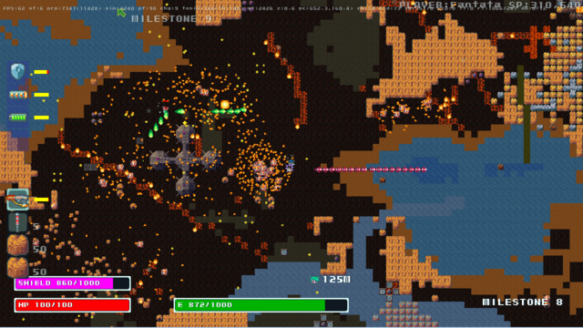
                       
 
 1. [P][GD] 2015/12 PSVita AirshipQ

 http://airshipq.com/

 http://www.jp.playstation.com/software/title/jp0178pcsg00461_001000000000000000.html

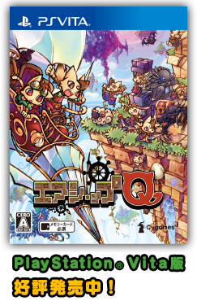

 
 1. [役] 2016/06 株式会社モノビット CTO

 http://www.4gamer.net/games/999/G999905/20160601141/
 
 1. [筆] 「深セン I/O」エレキ技術者の仕事をゲームに 日経テクノロジーOnline

 http://techon.nikkeibp.co.jp/atcl/column/15/102000074/111500005/?rt=nocnt

 1. [筆] 記憶に刻むあのコード "車輪を小さくして再発明する" Web+DB Press

 http://gihyo.jp/book/2018/978-4-7741-9686-2#toc

 1. [筆][P] 2018/09 クラウドゲームをつくる技術 
 
 https://www.amazon.co.jp/gp/product/4774199419

 

 1. [談] 2018/11 特濃！ゲーム開発塾　三陸直行便

 http://www.pref.iwate.jp/sangyoushinkou/digital/069112.html

 1. [談] 2019/09 CEDEC 2019 "MRU : Monobit Reliable UDP"
 
 https://www.slideshare.net/yhonjo/mru-monobit-reliable-udp-5g-179031080
 
 1. [談] 2019/10 サムザップ テックナイトvol.7 "ゲームの通信をつくる仕事はどうなるのだろう？"

 https://www.slideshare.net/kengonakajima1/ss-180868994
 
 1. [役] 2020/01 monoAI technology 取締役CTO

 会社名が変更されたことにより。

 1. [P,GD] Space Sweeper (Mac,Windows)

 https://kknn.itch.io/spsw

 1. [筆] 2024/10 図解まるわかり VR・AR・MRのしくみ (monoAI technology,翔泳社)

 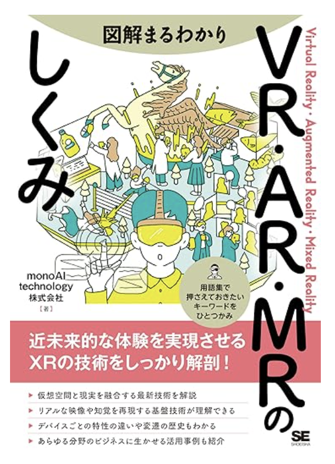
 
 https://www.amazon.co.jp/dp/4798185809
 書籍の元となったプロトタイプ原稿を執筆

短いプロフィール
====
    
「オンラインゲームを支える技術」での200文字プロフィール 

~~~
小学生の時からゲームプログラミングを始め、大学入学後ゲーム制作を開始。 (34)
96年、世界初のJavaアプレットを用いたMMORPGを制作し、 (32)
98年にはその続編LifestormシリーズをWindowsで発売、ヒット。 (38) = (102)
2001年にはオンラインゲーム用ミドルウェアVCEを開発し、(29)
独自に開発した"gumonji"を含めて約50社で利用される。 (31) = (60)
現在は2児の父として仕事と子育てに明け暮れる日々を送る。     (28)
~~~

2012年8月、IGF用のプロフィール

~~~
小学生の時からゲームプログラミングを始め、大学入学後ゲーム制作を開始。 
96年、世界初のJavaアプレットを用いたMMORPGを制作し、 
98年にはその続編LifestormシリーズをWindowsで発売、ヒット。 
2001年にはオンラインゲーム用ミドルウェアVCEを開発し、約50社で利用されている。
現在はMMOG制作と2児の子育てに明け暮れる日々を送っている。
詳しいプロフィールを https://github.com/kengonakajima/profile で公開している。
~~~

CEDEC 2015での300文字プロフィール

~~~
小学生の時からゲームプログラミングを始め、 20
高校時代には同人ゲームの開発と販売を試みる。 22
96年、世界初のJavaアプレットを用いたMMORPGを制作し、 32
2001年にはオンラインゲーム用ミドルウェアVCEを開発。 29
2005年の箱庭MMOG"gumonji", 22
2011年にはドラゴンクエストX, 2014年にはPS Vita用AirshipQ, 42
2015年にはクラウドMMOシューター「スペース・スウィーパー」など、 35
さまざまな通信ゲームを企画/プログラミングしまくる生活を続ける。 29
現在はクラウドゲームSDK "CCDK"の開発を行いつつ、 29
富山県において3児の父として仕事と子育てに明け暮れる日々を送る。 26
~~~

2016年11月のWeb記事用プロフィール

~~~

小学生の時からゲームプログラミングを始め、 
高校時代には同人ゲームの開発と販売を試みる。 
96年、世界初のJavaアプレットを用いたMMORPGを制作。
オンラインゲーム用ミドルウェアVCE、箱庭MMOG"gumonji"、
ドラゴンクエストX、PS Vita用AirshipQなどを経て、
2015年にはシンラ・テクノロジ社でクラウドゲームであるMMOシューター
「スペース・スウィーパー」とクラウドゲームSDK "CCDK"の開発を行う。
2016年夏から、株式会社モノビットのCTOとしてミドルウェアや
クラウドサービスの開発を担当。
現在は、富山県の稲作地帯において、仕事と子育てに明け暮れる日々を送る。 
~~~

2018年3月の雑誌用プロフィール 150文字版

~~~
小学生の時からゲームプログラミングを始める。 22
90年代後半から、ブラウザ向けMMORPG、PC用マルチプレイゲーム、 35
家庭用ゲームを経て、2000年にオンラインゲーム用ミドルウェアVCEを制作、販売開始。 37
2010年台はインディゲーム開発やクラウドゲームのプラットフォームを作り、 36
2016年夏からは、株式会社モノビットのCTOとして通信ミドルウェア事業の開発を担当。 42
現在は、富山の稲作地帯において、仕事と子育てに明け暮れる日々を送る。  33
仕事歴: https://github.com/kengonakajima/profile
~~~

2018年3月短い版
~~~
マルチプレイゲームの実装を専門とするプログラマー。
著書『オンラインゲームを支える技術』
（2011、技術評論社）。㈱モノビット CTO。
仕事歴：http://goo.gl/eMtEQ
~~~

写真

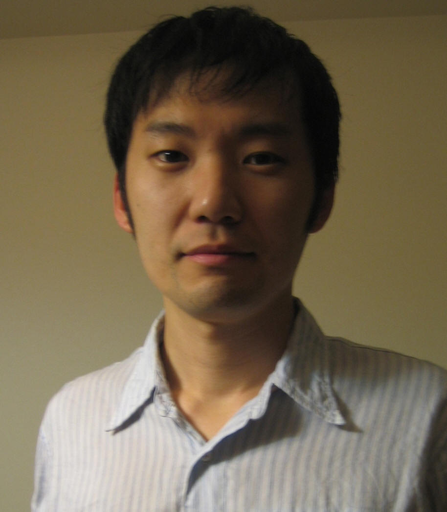 

 
gumonjiでのringo

 

 
自分でモデリングしたキャラ(from Rana)

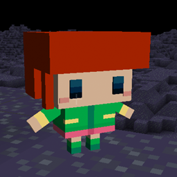 
